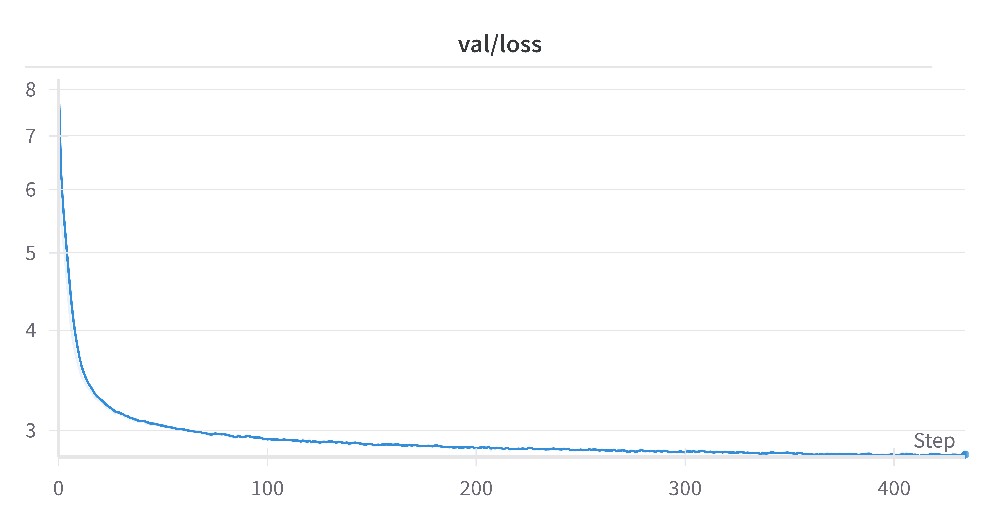

# gpt-ts

Install requirements

```
pip install -r requirements.txt
```

Download PLAsTiCC dataset 

```
python prepare_plasticc.py download
```

To upload models to hugging face (with the --push_to_hub option)

```
huggingface-cli login
```

To upload metrics to W&B

```
wandb login
```

## Token based

Prepare PLAsTiCC dataset 

```
python prepare_plasticc.py process --format tokens --token_window_size 1
```

This will produce 2 files in the generated plasticc directory with the following properties 

| File | Num sequences | Num tokens  |
|------|---------------|--------------------|
| train | 7,848         | 494,560            |
| test | 3,492,657     | 117,156,631        |

```
python prepare_plasticc.py process --format tokens --token_window_size 10
```
This will produce 2 files in the generated plasticc directory with the following properties 

| File | Num sequences | Num tokens  |
|------|---------------|-------------|
| train | 7,848         | 914,983     |
| test | 3,492,745     | 246,835,127 |

### Pre-training 

Pre-train on next token prediction. LLM scaling suggests model size of ~ 10m parameters. 

```
python train.py --task pretrain_lm --batch_size 128 --dataset_config plasticc/dataset_config_tokens.json 
--train_file plasticc/train_tokens.npy --train_file plasticc/test_tokens.npy --logger wandb --push_to_hub 
--hub_repo "gpt-pretrain-lm"
```



### Fine tuning 

Representative training on ~7848 samples 

```
python train.py --task finetune_class --batch_size 128 --dataset_config plasticc/dataset_config_tokens.json 
--train_file plasticc/train_tokens.npy --train_file plasticc/test_tokens.npy --logger wandb --push_to_hub 
--hub_from_pretrained "gpt-pretrain-lm" --val_fraction 0.99775
```

Original training 

```
python train.py --task finetune_class --batch_size 128 --dataset_config plasticc/dataset_config_tokens.json 
--train_file plasticc/train_tokens.npy --val_file plasticc/test_tokens.npy --logger wandb --push_to_hub 
--hub_from_pretrained "gpt-pretrain-lm"
```

## GP tokens

```
python prepare_plasticc.py process --format gp_tokens --token_window_size 10 --gp_max_sequences 1000
```