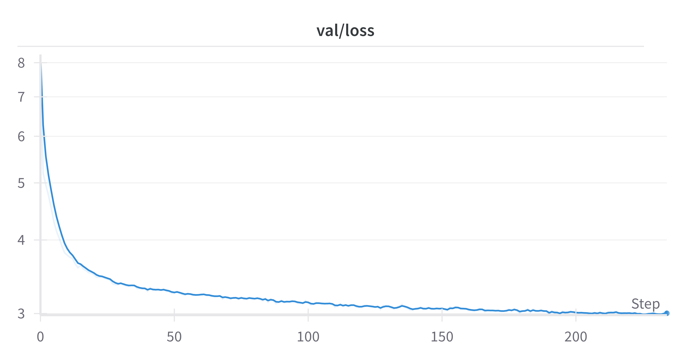

# gpt-ts

Install requirements

```
pip install -r requirements.txt
```

Download PLAsTiCC dataset 

```
python prepare_plasticc.py download
```

To upload models to hugging face (with the --push_to_hub option)

```
huggingface-cli login
```

To upload metrics to W&B

```
wandb login
```

## Token based

Prepare PLAsTiCC dataset 

```
python prepare_plasticc.py process --format tokens --token_window_size 1
```

This will produce 2 files in the generated plasticc directory with the following properties 

| File | Num sequences | Num tokens  |
|------|---------------|--------------------|
| train | 7,848         | 494,560            |
| test | 3,492,657     | 117,156,631        |

```
python prepare_plasticc.py process --format tokens --token_window_size 10
```
This will produce 2 files in the generated plasticc directory with the following properties 

| File | Num sequences | Num tokens  |
|------|---------------|-------------|
| train | 7,848         | 914,983     |
| test | 3,492,745     | 246,835,127 |

We find better fine-tuning performance using a token window of 1 as opposed to 10. 

### Pre-training 

Pre-train on next token prediction. LLM scaling suggests model size of ~ 10m parameters. 

```
python train.py --task pretrain_lm --batch_size 128 --dataset_config plasticc/dataset_config_tokens.json 
--train_file plasticc/train_tokens.npy --train_file plasticc/test_tokens.npy --logger wandb --push_to_hub 
--hub_repo "gpt-pretrain-lm"
```

The below graph shows the validation loss for a token window of 1. 



### Fine-tuning 

Representative training on ~7848 samples. 

```
python train.py --task finetune_class --batch_size 128 --dataset_config plasticc/dataset_config_tokens.json 
--train_file plasticc/train_tokens.npy --train_file plasticc/test_tokens.npy --logger wandb
--hub_from_pretrained "adammoss/gpt-pretrain-lm" --val_fraction 0.99775 --lora_rank 4 --lora_dropout 0.1
```

The below graph shows the validation loss, reaching a minimum of around 0.43. The loss just on the last token is slightly higher (~0.5). Suspect this is due to the total loss being dominated by longer sequences, which are more accurate.


Original training 

```
python train.py --task finetune_class --batch_size 128 --dataset_config plasticc/dataset_config_tokens.json 
--train_file plasticc/train_tokens.npy --val_file plasticc/test_tokens.npy --logger wandb
--hub_from_pretrained "adammoss/gpt-pretrain-lm" --lora_rank 4 --lora_dropout 0.1
```

The below graph shows the validation loss, reaching a minimum of around 0.59. The loss just on the last token is higher (~0.85).


Questions 

- Do low SN tokens hurt performance?

## GP tokens

```
python prepare_plasticc.py process --format gp_tokens --token_window_size 1 --gp_max_sequences 10000
```

### Pre-training 

Pre-train on next token prediction. LLM scaling suggests model size of ~ 10m parameters. 

```
python train.py --task pretrain_lm --batch_size 128 --dataset_config plasticc/dataset_config_gp_tokens.json 
--train_file plasticc/plasticc_train_lightcurves_gp_tokens.npy 
--train_file plasticc/plasticc_test_lightcurves_*_gp_tokens.npy --logger wandb --push_to_hub 
--hub_repo "gpt-pretrain-lm-gp"
```

### Fine-tuning 

Representative training on ~7848 samples. 

```
python train.py --task finetune_class --batch_size 128 --dataset_config plasticc/dataset_config_gp_tokens.json 
--train_file plasticc/plasticc_train_lightcurves_gp_tokens.npy --train_file plasticc/plasticc_test_lightcurves_*_gp_tokens.npy 
--logger wandb --hub_from_pretrained "adammoss/gpt-pretrain-lm" --val_fraction 0.99775 
--lora_rank 4 --lora_dropout 0.1
```

Original training

```
python train.py --task finetune_class --batch_size 128 --dataset_config plasticc/dataset_config_gp_tokens.json 
--train_file plasticc/plasticc_train_lightcurves_gp_tokens.npy --val_file plasticc/plasticc_test_lightcurves_*_gp_tokens.npy 
--logger wandb  --hub_from_pretrained "adammoss/gpt-pretrain-lm" --lora_rank 4 --lora_dropout 0.1
```

## Patch

### Pre-train

```
python train.py --task pretrain_mask --model patch --train_file plasticc/plasticc_test_lightcurves_*_gp_sample.npy 
--train_file plasticc/plasticc_train_lightcurves_gp_sample.npy
--random_mask_ratio 0.5 --dataset_config plasticc/dataset_config_gp_sample.json --transform arcsinh 
--n_embd 384 --batch_size 256 --num_epochs 400 --logger wandb --push_to_hub --hub_repo adammoss/patch-pretrain-mask
```

### Fine-tuning

```
python train.py --task finetune_class --model patch --train_file plasticc/plasticc_test_lightcurves_*_gp_sample.npy 
--train_file plasticc/plasticc_train_lightcurves_gp_sample.npy --dataset_config plasticc/dataset_config_gp_sample.json 
--transform arcsinh --batch_size 256--num_epochs 400 --logger wandb
```